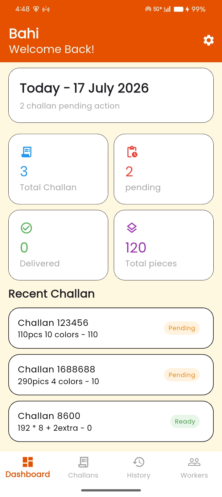
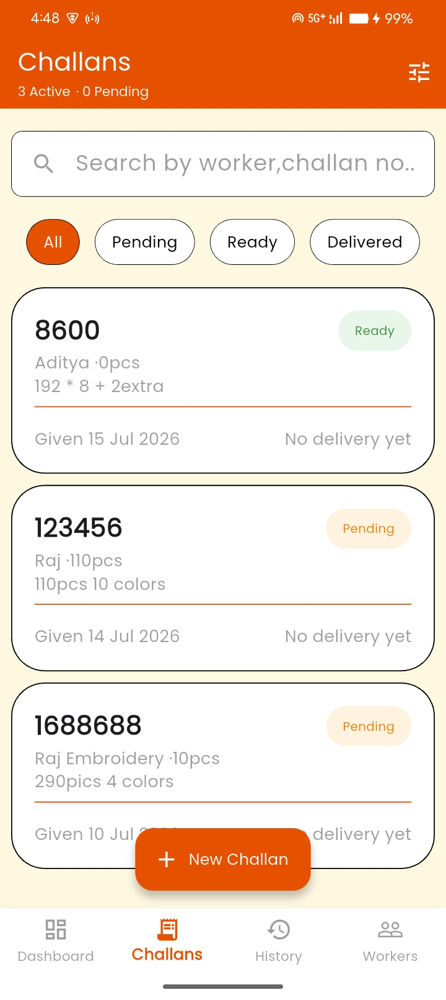
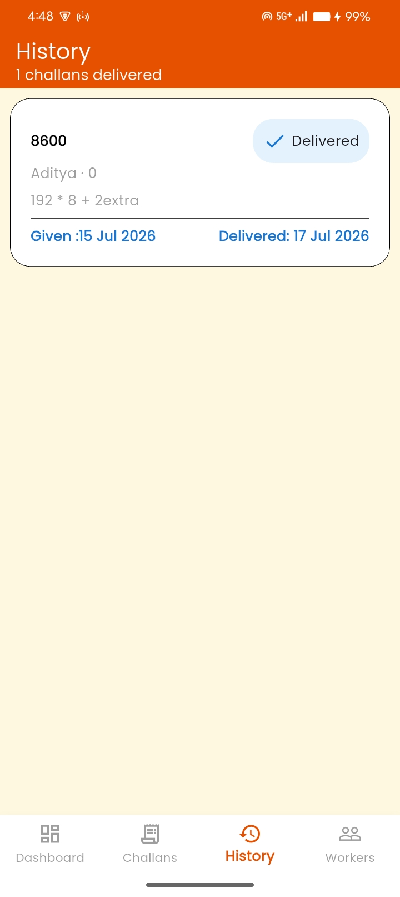
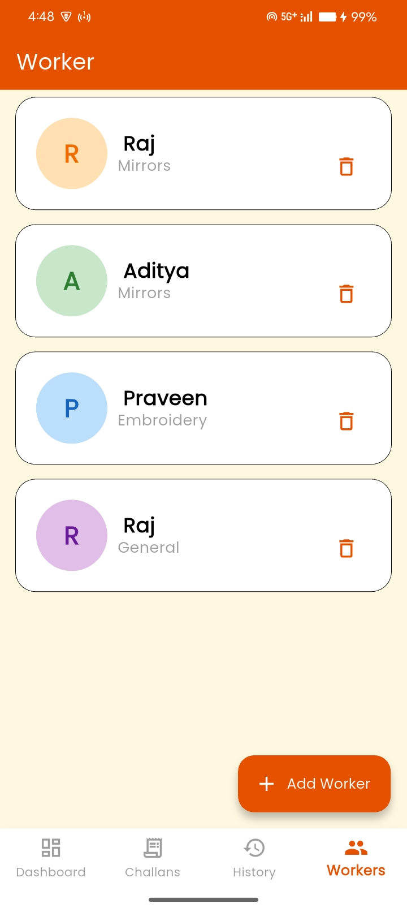
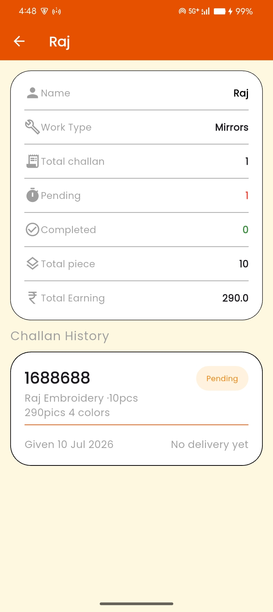
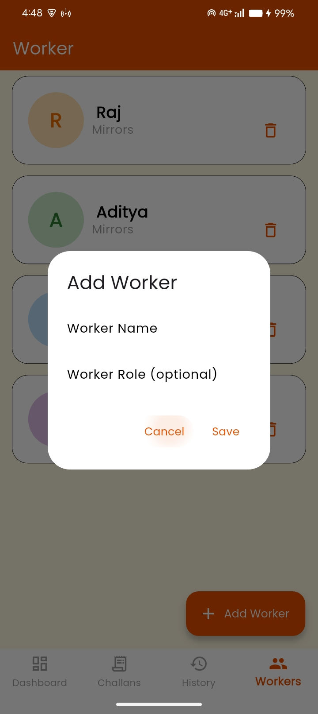
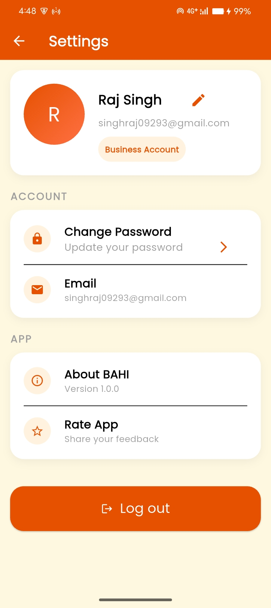
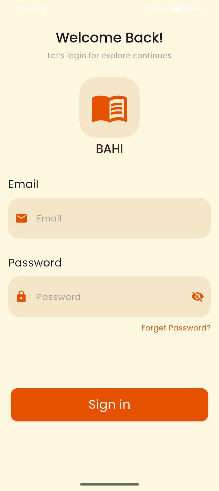
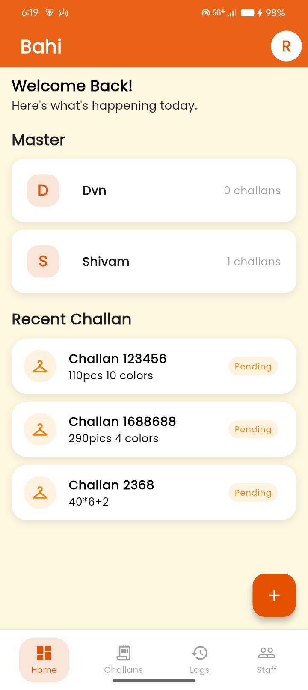

# 📒 Bahi — Digital Challan & Worker Management App

> **No notebook. No confusion. No data loss.**

Bahi digitalizes the traditional paper-based challan system used in garment manufacturing. Built for the *master* (business owner) who manages multiple workers and tracks daily cloth piece distribution, work types, and earnings — all from a single app.

---

## 🎯 Problem It Solves

Garment manufacturing masters manage dozens of workers daily — distributing cloth pieces, tracking embroidery/handwork/mirror work, and calculating earnings at month end. This was all done manually in paper registers, leading to:

- Lost or damaged records
- Calculation errors
- No quick way to check a worker's history

**Bahi replaces the register with a clean, fast mobile app.**

---

## ✨ Features

- 🔐 **Master Login** — Secure single-owner authentication
- 👷 **Worker Management** — Add workers once, reuse forever
- 📋 **Daily Challan Creation** — Log which worker got how many pieces, and what type of work (embroidery / handwork / mirrors)
- 📦 **Status Tracking** — Track each challan from `Pending → In Progress → Delivered`
- 📊 **Worker History** — View any worker's complete challan history at any time
- 💰 **Earnings Summary** — Total pieces handled and total earnings per worker, calculated automatically

---

## 🛠️ Tech Stack

| Layer | Technology |
|---|---|
| Framework | Flutter |
| State Management | Riverpod |
| Backend / Database | Firebase Firestore |
| Authentication | Firebase Auth |
| Architecture | Clean Architecture |

---

## 📱 Screenshots

>         

---

## 🚀 Getting Started

### Prerequisites
- Flutter SDK (3.x+)
- Firebase project set up

### Installation

```bash
# Clone the repo
git clone https://github.com/singhraj09293/bahi.git

# Navigate to project
cd bahi

# Install dependencies
flutter pub get

# Run the app
flutter run
```

> Make sure to add your own `google-services.json` (Android) and `GoogleService-Info.plist` (iOS) from your Firebase console.

---

## 🏗️ Architecture

```
lib/
├── core/           # Constants, utils, error handling
├── features/
│   ├── auth/       # Login (data, domain, presentation)
│   ├── workers/    # Worker management
│   └── challans/   # Challan CRUD + status tracking
└── main.dart
```

---

## 👨‍💻 Author

**Raj Singh**
Final Year BSc IT — BK Birla College, Kalyan
[GitHub](https://github.com/singhraj09293)

---

## 📄 License

This project is for portfolio and educational purposes.
